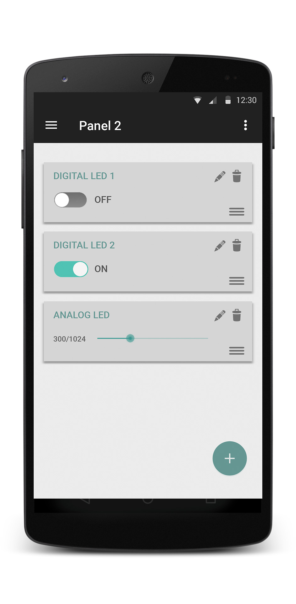

# Easy-Arduino

Esta app permitirá controlar una serie de componentes tales como LEDs, servo motores, diversos sensores, etc... conectados a un Arduino. Para ello, se mandarán comandos por puerto serie a través de USB desde nuestro dispositivo Android.
<br>

## Tabla de contenidos

1. [Diseño de la aplicación](README.md#diseño-de-la-aplicación)
1. [Funcionamiento de la aplicación](README.md#funcionamiento-de-la-aplicación)
   * [Funcionamiento de la comunicación](README.md)
   * [Almacenamiento de datos](README.md#almacenamiento-de-datos)
1. Consideraciones de desarrollo
1. Evolución del proyecto
1. [Funcionalidades extra](README.md#posibles-funcionalidades-extra)


<br><br><br>
## DISEÑO DE LA APLICACIÓN

Esta app permitir  controlar una serie de componentes tales como LEDs, servo motores, diversos sensores, etc... conectados a un Arduino. Para ello, se mandar n comandos por puerto serie a trav s de USB desde nuestro dispositivo Android.
Dispondr  de dos elementos principales, a los que llamaremos paneles y controladores. Los paneles podemos entenderlos como mandos a distancia que incluyen diversos botones. Los controladores ser an en ese caso cada uno de los botones, permiti ndonos interactuar con los distintos componentes que est n conectados al Arduino.

A continuación se muestra un prototipo de la aplicación donde podemos ver dos paneles, el de la izquierda con dos controladores, y del de la derecha con tres controladores:

<p align="center">
  
  
</p>

Al crear uno de dichos paneles, y elegir con qu  componentes va a querer interactuar, al usuario se le dispondr n una serie de layouts (controladores) que contendr n, por ejemplo, un botón para encender un LED, un cuadro de texto donde se mostrar  el valor en tiempo real de un sensor de temperatura, etc...

El usuario podrá crear distintos paneles con distintos controladores en cada uno, así como renombrarlos, o eliminarlos.

<br>

> **Nota:** Hemos creado un pequeño esquema con una aproximación general del diseño de la aplicación en [design_ideas.jpg](documentation/images/design_ideas.jpg), donde se representan dos casos de uso, 'añadir nuevo panel' y 'añadir nuevo controlador'.

<br><br><br>

## FUNCIONAMIENTO DE LA APLICACIÓN

### Funcionamiento de la comunicación Android-Arduino
Para comunicarse, nuestro dispositivo Android mandará mensajes por puerto serie al Arduino, quien los interpretará y llevará a cabo las acciones necesarias. Dichos mensajes se regirán por el siguiente formato:

    *PINTYPE-COMMANDTYPE-ARDUINOPIN-DATA
    
    *            Carácter que marca el inicio de la instrucción
    PINTYPE      (Analog o Digital)   1 carácter
    COMMANDTYPE  (Read o Write)       1 carácter
    ARDUINOPIN   (Pin del arduino)    2 caracteres
    DATA         (Valor a escribir)   4 caracteres

Por ejemplo, para encender un led que se encuentra en el pin 9 del arduino, el comando que recibirá el Arduino será el siguiente:

    *D-W-08-0001

Usando como ejemplo un servo motor que se encuentre conectado al pin 3 del Arduino, para girar dicho servo motor un ángulo de 130º, el comando utilizado sería el siguiente:
    
    *A-W-03-0130

> **Nota:** Para obtener datos en tiempo real del Arduino, como por ejemplo con sensores de temperatura o similares, en el comando, la parte de "Data" tomará el valor '0000'.

### Almacenamiento de datos
La aplicación no almacenará los datos leídos del Arduino. Sin embargo, los paneles creados por el usuario con todos sus controladores sí se guardarán. 

Para guardar los datos de cada panel, se almacenará en la memoria del teléfono un json con el siguiente esquema:

```json
{
  "pannel_1":{
      "controllers":[
        {
          "name":"LED_1",
          "arduinoPin":8,
          "data":0
        },
        {
          "name":"Sensor temperatura",
          "arduinoPin":9,
          "refreshRate":5
        }
      ]
  },
  "pannel_2":{
      "..."
  }
}
```

<br><br><br>

## CONSIDERACIONES DE DESARROLLO

### Comunicación Android-Arduino
En nuestra aplicación, la comunicación entre Arduino y Android se llevará a cabo a través de USB. Sin embargo, en un futuro esto podría cambiar, e implementarse la comunicación mediante otras tecnologías como, por ejemplo, Bluetooth o wifi. Para permitir esta escalabilidad, crearemos un paquete llamado ‘arduinomanager’, donde se incluirá una interfaz, cada una de las implementaciones de dicha interfaz para cada tecnología usada (USB en nuestro caso) y clases adicionales para códigos de respuesta o interfaces que permitan crear listeners de la comunicación.

### Comunicación USB
Para poder utilizar la comunicación serie por USB del dispositivo Android usaremos una librería externa, [usbserial](https://github.com/felHR85/UsbSerial) creada por [felHR85](https://github.com/felHR85) disponible en GitHub.

### Arquitecturas utilizadas
La aplicación tendrá implementado un broadcast receiver, que permitirá cerrar la conexión serie con el Arduino cuando se desconecte el cable USB. Así mismo, cuando se conecte un cable USB, se iniciará la conexión.
Para permitir que el layout sea dinámico, haremos uso de fragmentos en distintas partes del proyecto.
Cabe la posibilidad de que se usen threads para ciertas tareas como leer datos del arduino, a pesar de que la librería ‘usbserial’ ya se encarga de gestionar el USB de forma asíncrona.

<br><br><br>

## EVOLUCIÓN DEL PROYECTO

### Iteraciones
El proyecto tendrá una evolución iteracional, añadiendo nuevas funcionalidades con cada versión de la aplicación.

Para la primera iteración, se implementará toda la parte de comunicación serie mediante Arduino y Android, permitiendo comandos básicos de envío de datos a Arduino, no de lectura. Se crearán también los primeros ‘controladores’ dentro de un panel de prueba. No se tendrá en cuenta el estado del UI ni UX de la aplicación.

En la segunda iteración del proyecto, se permitirá al usuario crear paneles, as  como guardar los contenidos y estados de cada uno de ellos.

En la tercera iteración, se crearán controladores que permitan lectura de datos de Arduino. En posteriores iteraciones, se llevarán a cabo las siguientes tareas en el orden descrito:
* Permitir al usuario modificar o eliminar un panel
* Permitir al usuario modificar o eliminar los controladores dentro de un panel
* Crear un UI y UX
* Funcionalidades extras descritas más adelante en este documento

### Responsabilidades
Jose Luis Álvarez
* Paso de mensajes Android-Arduino
* Interfaz de usuario y UX
* Extras : Gráficas en tiempo real *(Ver siguiente apartado)*

Matías Cubilla
* Gestión de paneles y controladores
* Guardar controladores y paneles en memoria del teléfono
* Broadcast Receivers
* Extras : Creación de código Arduino *(Ver siguiente apartado)*

<br><br><br>

## POSIBLES FUNCIONALIDADES EXTRA

### Gráficas con valores leídos de Arduino en tiempo real
Crear gráficas para monitorizar en tiempo real los valores de los sensores. Solo contendrán los valores recibidos desde que se creó la gráfica, no se almacenarán datos en el dispositivo Android. Para acceder a dichas gráficas, los controladores marcados como de lectura analógica, dispondrán de un botón que crear esta nueva actividad.

### Creación de código para el Arduino
Dispondremos para nuestra aplicación de una opción que permita crear el archivo .ino que ha de subirse al Arduino para poder comunicarse correctamente con la aplicación Android. Para ello, descargar el archivo en el propio teléfono Android no tendría mucho sentido, por lo que estamos planteándonos cual es la mejor opción.
