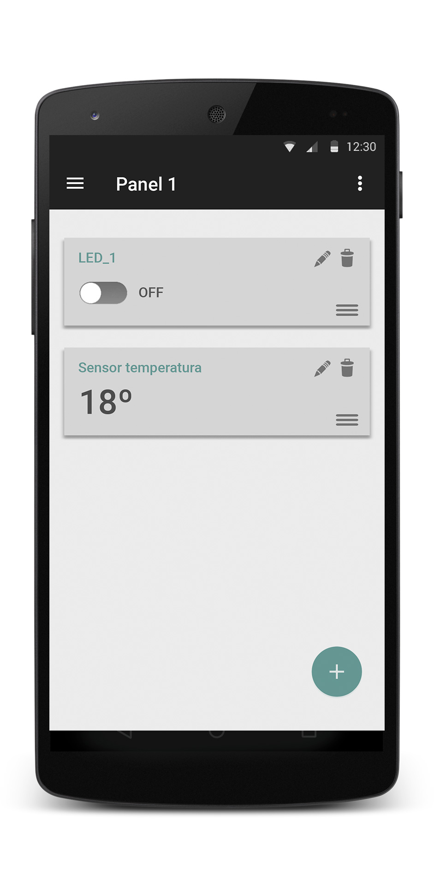

# App para controlar dinámicamente circuitos con Arduino

Esta app nos permitirá controlar una serie de componentes tales como LEDs, servo motores, diversos sensores, etc... conectados a un Arduino. Para ello, se mandarán comandos por puerto serie a través de USB desde nuestro dispositivo Android.
<br>

## Tabla de contenidos

1. [Diseño de la aplicación](README.md#diseño-de-la-aplicación)
1. [Funcionamiento de la aplicación](README.md#funcionamiento-de-la-aplicación)
   * [Comunicación Android-Arduino](README.md#comunicación-android-arduino)
   * [Almacenamiento de datos](README.md#almacenamiento-de-datos)
   * [Otras características](README.md#otras-caracter%C3%ADsticas)
1. [Funcionalidades extra](README.md#posibles-funcionalidades-extras)
1. [Primera itearción](README.md#primera-iteración)


<br><br><br>

## Diseño de la aplicación

Nuestra aplicación dispondrá de dos elementos principales, a los que llamaremos paneles y controladores. 
Los paneles podemos entenderlos como mandos a distancia que incluyen diversos botones. Los controladores serían en ese caso cada uno de los botones, permitiéndonos interactuar con los distintos componentes que estén conectados al Arduino.

A continuación se muestra un prototipo de la aplicación donde podemos ver dos paneles, el de la izquierda con dos controladores, y del de la derecha con tres controladores:

<p align="center">
  
  
</p>

Al crear uno de dichos paneles, y elegir con qué componentes va a querer interactuar, al usuario se le dispondrán una serie de layouts (controladores) que contendrán, por ejemplo, un botón para encender un LED, un cuadro de texto donde se mostrará el valor en tiempo real de un sensor de temperatura, etc...

El usuario podrá crear distintos paneles con distintos controladores en cada uno, así como renombrarlos, o eliminarlos.

<br>

> **Nota:** Hemos creado un pequeño esquema con una aproximación general del diseño de la aplicación en [design_ideas.jpg](documentation/images/design_ideas.jpg), donde se representan dos casos de uso, 'añadir nuevo panel' y 'añadir nuevo controlador'.

<br><br><br>

## Funcionamiento de la aplicación

### Comunicación Android-Arduino
Para comunicarse, nuestro dispositivo Android mandará mensajes por puerto serie al Arduino, quien los interpretará y llevará a cabo las acciones necesarias. Dichos mensajes se regirán por el siguiente formato:

    *PINTYPE-COMMANDTYPE-ARDUINOPIN-DATA
    
    *            Carácter que marca el inicio de la instrucción
    PINTYPE      (Analog o Digital)   1 carácter
    COMMANDTYPE  (Read o Write)       1 carácter
    ARDUINOPIN   (Pin del arduino)    2 caracteres
    DATA         (Valor a escribir)   4 caracteres

Por ejemplo, para encender un led que se encuentra en el pin 9 del arduino, el comando que recibirá el Arduino será el siguiente:

    *D-W-08-0001

Usando como ejemplo un servo motor que se encuentre conectado al pin 3 del Arduino, para girar dicho servo motor un ángulo de 130º, el comando utilizado sería el siguiente:
    
    *A-W-03-0130

> **Nota:** Para obtener datos en tiempo real del Arduino, como por ejemplo con sensores de temperatura o similares, en el comando, la parte de "Data" tomará el valor '0000'.

### Almacenamiento de datos
La aplicación no almacenará los datos leídos del Arduino. Sin embargo, los paneles creados por el usuario con todos sus controladores sí se guardarán. 

Para guardar los datos de cada panel, se almacenará en la memoria del teléfono un json con el siguiente esquema:

```json
{
  "pannel_1":{
      "controllers":[
        {
          "name":"LED_1",
          "arduinoPin":8,
          "data":0
        },
        {
          "name":"Sensor temperatura",
          "arduinoPin":9,
          "refreshRate":5
        }
      ]
  },
  "pannel_2":{
      "..."
  }
}
```

### Otras características
La aplicación se iniciará automáticamente cuando se conecte un Arduino mediante USB al dispositivo Android. Cuando se desconecte el USB, cerraremos el puerto serie. Esta implementación se basará en Broadcast Receivers.

<br><br><br>

## Posibles funcionalidades extras

### Layouts
Crear gráficas para monitorizar en tiempo real los valores de los sensores. Solo contendrán los valores recibidos desde que se creó la gráfica, no se almacenarán datos en el dispositivo Android.

### Creación de código para el Arduino
Dispondremos para nuestra aplicación de una opción que permita crear el archivo .ino que ha de subirse al Arduino para poder comunicarse correctamente con la aplicación Android. 
Para ello, descargar el archivo en el propio teléfono Android no tendría mucho sentido, por lo que estamos planteándonos cual es la mejor opción.


<br><br><br>


## Primera iteración
Para la primera iteración de la práctica crearemos una aproximación inicial a la aplicación. Se desarrollará el API de la comunicación serie con Arduino, pero el resto de funcionalidades quedarán a la espera. 
En cuanto al layout, se usará uno provisional que no representará al definitivo.


<br><br>
****

## Ideas
* Fragment para representar gráficas
